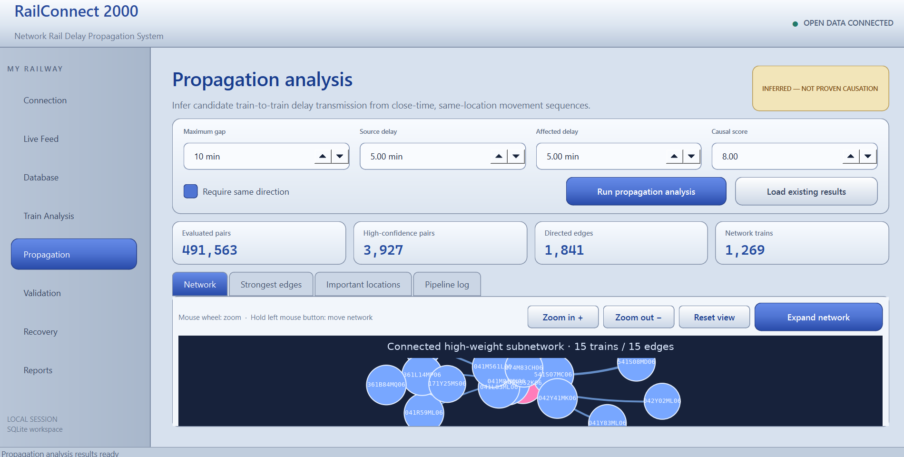
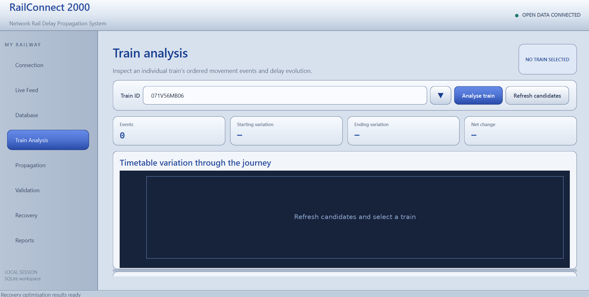
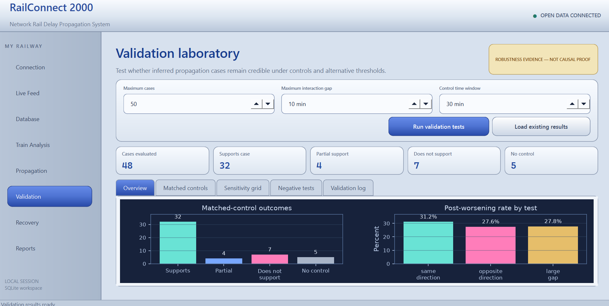
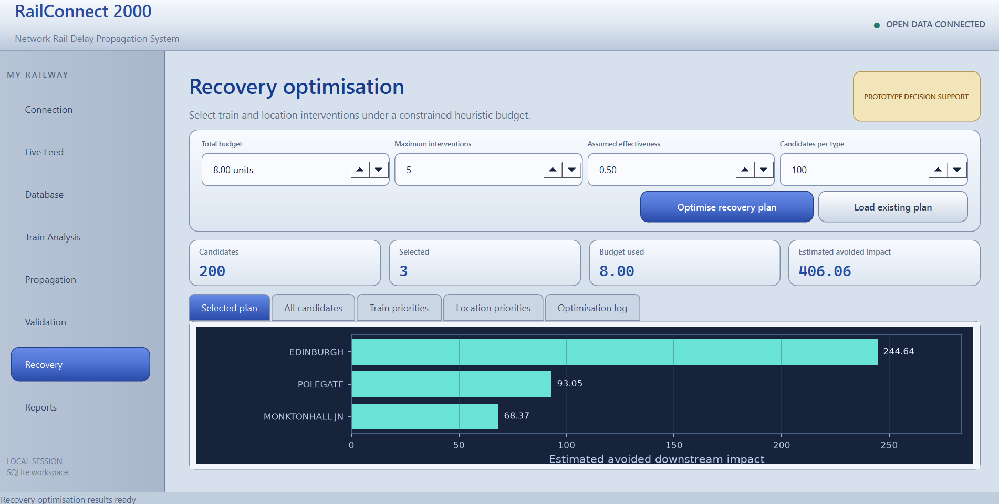
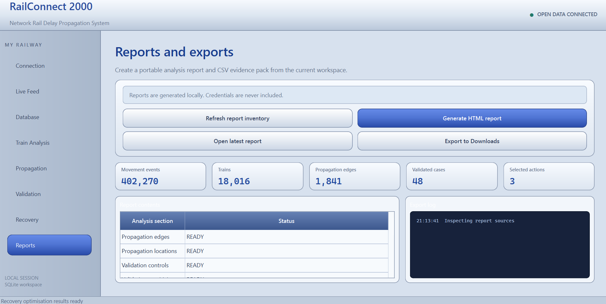

# Network-Rail-Delay-Propagation-Pipeline
End-to-end railway delay propagation and recovery optimisation platform using Network Rail timetable and TRUST movement data. Combines data engineering, network analysis, validation, visualisation and operations research to identify delay sources, infer knock-on effects and optimise recovery interventions.


## RailConnect 2000 desktop application

**RailConnect 2000** is a PySide6 desktop interface built around the analytical
pipeline in this repository. It provides a single environment for acquiring
Network Rail Open Data, constructing the local database, exploring individual
train movements, analysing candidate delay propagation, testing robustness,
optimising recovery interventions and exporting results.

> **Development status:** The Version 1 analytical pipeline and desktop
> interface are implemented and have been tested end to end when run from
> source. A standalone Windows installer has not yet been released.

<p align="center">
  
</p>

<p align="center">
  <em>
    The propagation-analysis workspace, showing parameter controls, summary
    metrics and an interactive directed train network.
  </em>
</p>

### Application capabilities

| Module | Functionality |
|---|---|
| **Connection** | Accepts the user's Network Rail Open Data credentials and tests access without saving the password to disk. |
| **Live Feed** | Connects to the TRUST movement feed using STOMP and captures movement messages to timestamped local JSONL files. |
| **Database** | Downloads CIF timetable data, builds the SQLite workspace and imports captured movement events. |
| **Train Analysis** | Selects an individual train and displays its ordered movement history, timetable variation, event-level changes and delay trajectory. |
| **Propagation** | Identifies close-time, same-location train interactions and constructs a directed network of candidate delay-transmission relationships. |
| **Validation** | Compares inferred cases with nearby local controls, performs threshold-sensitivity analysis and runs negative/control stress tests. |
| **Recovery** | Ranks train and location interventions and solves a constrained binary selection problem under a user-defined budget. |
| **Reports** | Produces a local HTML analysis report, exports supporting tables to CSV and packages the results into a downloadable ZIP archive. |

### Interface showcase

#### Individual train analysis

The train-analysis page reconstructs a selected train's ordered movement events.
It visualises how timetable variation changes over the course of the journey and
provides the corresponding event time, location, event type, platform and delay
status.

<p align="center">
  
</p>

#### Interactive propagation network

The propagation page converts inferred train-to-train relationships into a
directed weighted network. Users can zoom, pan and expand the visualisation,
while node labels remain associated with the represented trains. Additional tabs
list the strongest edges, important locations and pipeline progress.

The application considers:

- temporal ordering between train movements;
- occurrence at the same operational location;
- optional agreement in travel direction;
- source and affected-train delay thresholds;
- worsening after the candidate interaction;
- whether post-interaction worsening exceeds prior deterioration;
- time separation between the two trains; and
- repeated evidence across events and locations.

These elements are combined into a transparent heuristic score. Relationships
passing the selected rules are aggregated into directed edges and weighted
according to repeated interactions, location coverage, delay worsening and
temporal proximity.

The resulting relationships are **candidate propagation hypotheses**. They
identify structured associations in the observed movement data but do not, by
themselves, prove operational causation.

#### Validation laboratory

The validation module tests whether the inferred relationships remain credible
under alternative assumptions. It includes:

1. **Matched local controls** — candidate cases are compared with other trains
   passing through the same location and direction within a surrounding time
   window.
2. **Threshold sensitivity** — the calculation is repeated across a \(3\times3\)
   grid of time-gap and delay thresholds.
3. **Negative/control tests** — normal same-direction results are compared with
   less plausible opposite-direction and larger-time-gap interactions.

<p align="center">
  
</p>

The validation results are classified as supporting, partially supporting or
not supporting each candidate case. Cases for which no suitable local comparison
can be constructed are reported separately rather than silently discarded.

#### Recovery optimisation

The recovery module converts the inferred propagation network into a prototype
operations-research decision problem. Candidate interventions are constructed
for influential source trains and important locations.

Each candidate is assigned:

- an estimated downstream benefit;
- an intervention cost;
- an affected-train count;
- an assumed intervention effectiveness; and
- a network-derived priority score.

An exact 0/1 dynamic-programming solver selects the combination of interventions
with the greatest estimated benefit while respecting the total budget and
maximum number of permitted actions.

<p align="center">
  
</p>

This is a research decision-support model. Intervention costs, effectiveness and
avoided impact are modelling assumptions rather than calibrated operational
estimates.

#### Reporting and export

The reporting page collects the available propagation, validation and recovery
tables into a portable evidence pack. It generates:

- a formatted HTML report;
- complete CSV tables;
- summary metrics;
- an interpretation notice; and
- a ZIP archive that can be exported to the user's Downloads folder.

<p align="center">
  
</p>

## Example results

The following figures were obtained from one completed pipeline run and will
vary with the capture period and selected analytical thresholds.

| Metric | Example result |
|---|---:|
| Movement events loaded | 402,270 |
| Close-time train pairs evaluated | 491,563 |
| High-confidence candidate pairs | 3,927 |
| Directed propagation edges | 1,841 |
| Trains represented in the network | 1,269 |
| Propagation locations | 596 |
| Matched-control cases evaluated | 48 |
| Cases supporting the inferred relationship | 32 |

One full timetable build contained approximately **596,000 schedules** and
**9.4 million scheduled-location records**, demonstrating that the pipeline can
work with realistically large railway datasets using a local SQLite database.

## Technical architecture

```text
Network Rail CIF timetable data ─┐
                                 ├─> SQLite railway database
TRUST movement messages ─────────┘             │
                                               ▼
                                     Train-level analysis
                                               │
                                               ▼
                                  Propagation inference
                                               │
                                  ┌────────────┴────────────┐
                                  ▼                         ▼
                         Validation controls      Network visualisation
                                  │                         │
                                  └────────────┬────────────┘
                                               ▼
                                    Recovery optimisation
                                               │
                                               ▼
                                      HTML and CSV reports
